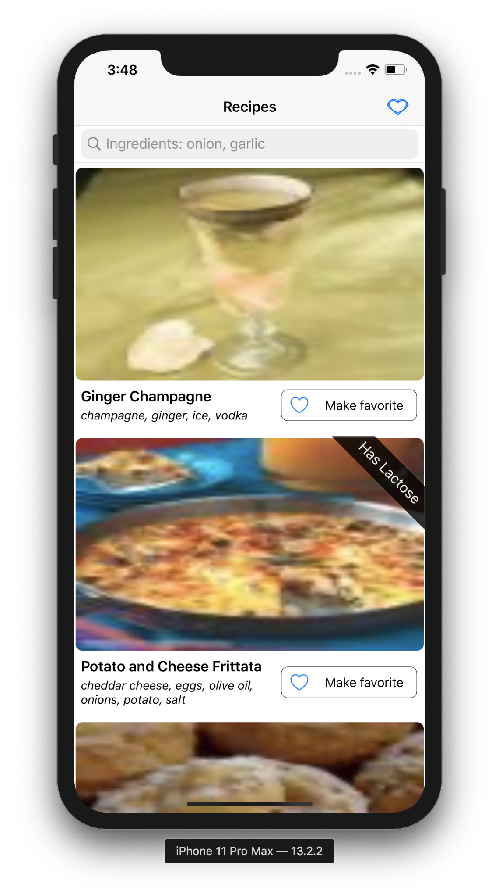
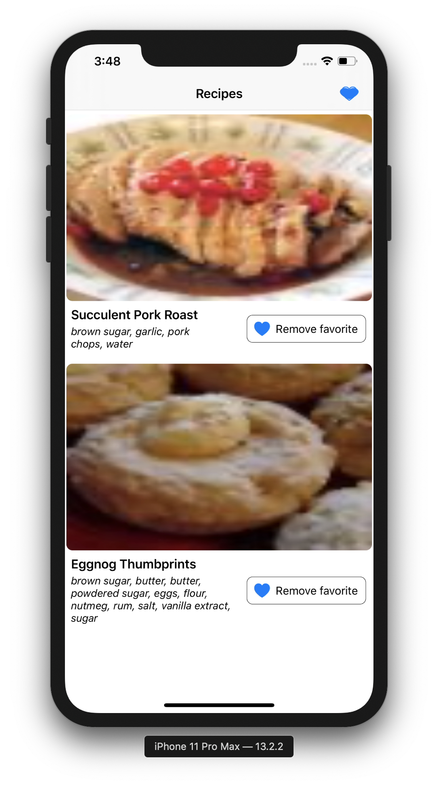
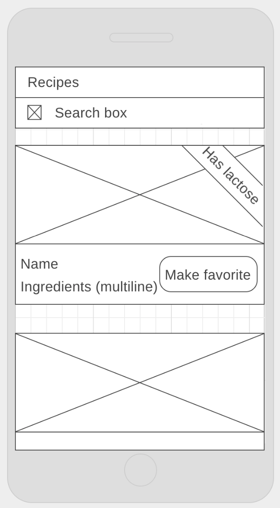

# Building a Recipes Book

<p align="center">


</p>

- [Building a Recipes Book](#building-a-recipes-book)
  - [The challenge](#the-challenge)
  - [Implicit requiments of the task](#implicit-requiments-of-the-task)
- [Development Story](#development-story)
  - [Initial API Analysis](#initial-api-analysis)
    - [Observations](#observations)
  - [Documentation of the process](#documentation-of-the-process)
    - [Project architecture (**VIPER**)](#project-architecture-viper)
    - [UI (**Snapkit**)](#ui-snapkit)

## The challenge

This challenge should be done by using the free to use RecipePuppy API. We would like you to retrieve some recipes from there, display the recipes and perform certain operations on those recipes. Hereby the details:

1. API connection, you should use their search endpoint and perform recipe searches with one or multiple ingredients (ie: http://www.recipepuppy.com/api/?i=onions,garlic&p=1) and parse the results. We would like you to use the networking tools iOS provides and not an external library.
2. Use a searchbar as user input for the first point and show the results in a collection view with a layout like the following. Each recipe should show the image on top, the recipe name, ingredients (this one could have multiple lines so the layouts should support dynamic heights) and a label in a 45% angle that would show only if it contains lactose (to simplify consider that only milk and cheese contain lactose).

<p align="center">

</p>

3. Add pagination to the list whenever the user scrolls,this should be as seamless as possible.
4. Each recipe has an href parameter that is an URL pointing to a website with the recipe details. Whenever the user clicks on a recipe use this parameter to open the website in a new view without leaving the app.
5. Offline functionality, each recipe should have a favorite button and clicking it should save the full recipe offline. Create a separate screen and a way to access it to show the favorite recipes.

## Implicit requiments of the task

- [x] Use latest Swift code.
- [x] Project architecture
  - [x] VIPER encouraged, but don’t enforced
  - [x] Good project structure
  - [x] Clear responsibilities of each component.
- [x] Code quality:
  - [x] Appropriate data structures
  - [x] Typical programming patterns
  - [x] Good practices.
- [ ] Documentation: while we don’t document all our code we do want to have clear documentation of key, complex or reusable components of our projects.
  - [x] Some really important edge cases.
  - [ ] Reusable components are not completely documented
- [ ] Testing
  - [ ] Unit Test
  - [ ] UI Test
  - [ ] Integration
  - [ ] Every kind of test you can imagine
  - [x] Testable code.
- [x] UI: 
  - [x] Use Nibs -not enforced
    - Used programmatically interfaces - Snapkit
  - [x] Avoid fixed sizes (in cases that it's possible)
- [x] Git history
  - [x] Add a local git repository
  - [x] Use a good git flow
    - I'll mark it as done as it's something I can demostrate in other ways, but I forgot to start using it from the beginning.
- [ ] Reason about your choices and defend your opinions and decisions
  - [ ] Why have you used a certain data structure?
  - [ ] Which alternatives did you consider?
  - [ ] what would you improve if you had more time?

# Development Story

## Initial API Analysis

> For the analysis of the API has been used the vscode extension **Rest Client** and the app **Insomnia**

- Base Search API
**GET** http://www.recipepuppy.com/api/

Optional Parameters:

- `i`: comma delimited ingredients
- `q` : normal search query
- `p` : page


**GET** http://www.recipepuppy.com/api/?i=onions,garlic&p=2

Example Result

```json
{
  "title": "Recipe Puppy",
  "version": 0.1,
  "href": "http:\/\/www.recipepuppy.com\/",
  "results": [ 
        {
            "title": "Roasted Garlic Grilling Sauce \r\n\t\t\r\n\t\r\n\t\t\r\n\t\r\n\t\t\r\n\t\r\n\t\r\n\r\n",
            "href": "http:\/\/www.kraftfoods.com\/kf\/recipes\/roasted-garlic-grilling-sauce-56344.aspx",
            "ingredients": "garlic, onions, hot sauce",
            "thumbnail": "http:\/\/img.recipepuppy.com\/634118.jpg"
        }
   ]
}
```

### Observations

- String content received needs to be trimmed. (`"Roasted Garlic Grilling Sauce\r\n\t\t\r\n\t\r\n\t\t\r\n\t\r\n\t\t\r\n\t\r\n\t\r\n\r\n"`)
- Result

```json
    {
       "title": String,
        "href": String,
        "ingredients": String,
        "thumbnail": String,
    }
```

- The API is not stable, for some cases, for example, asking for the second page produces a **500** error and returns a **404 File Not Found** html
**GET** http://www.recipepuppy.com/api/?i=onions,garlic&q=&p=2

But, while asking for the 3 page, it produces results:

 **GET** http://www.recipepuppy.com/api/?i=onions,garlic&q=&p=101

- Pagination
  - In some cases empty result sets are received for one page and for the next one, actual results are returned.
  - There's no documented way to know for the amount of pages available. The API just return:
  - It would be needed to try to fetch a couple of pages in advance before reporting as finished the list of recipes

## Documentation of the process

### Project architecture (**VIPER**) 

   **Why choosing to use it even if it's not enforced?**

| PROS                                                     | CONS
| -------------------------------------------------------  | -----------------------------------------------------------------------------------|
| It's used by many of the recent companies in the field   | Extra Boilerplate.                                                                 |
| It's seen as an improvement over MVVM.                   | It would take some research time to master.                                        |
|It could solve some of the problems I'm facing with MVVM. | I may make several mistakes                                                        |
| Personal opportunity to learn with a hands on strategy.  | Some degree of uncertainty regarding being able to finish in time the task in hand |

  **The takeaways:**

- I found [VIPERA](https://github.com/CoreKit/VIPERA) and [this blogpost](https://theswiftdev.com/2019/09/18/how-to-build-swiftui-apps-using-viper/) as the most valuable assets for getting into it. The structure can be a bit messy when you fill pressure to learn it fast and you find that there are many ways to do it.
- It would have been easier to use MVVM as I have previous experience with it. But I would have lost the oportunity to learn something with a real goal/application in mind. At the end, from my experience, we really get to learn something **well** when we have an inmediate application for it.
- Some degree of expertise is required to handle some of the cases. I found myself not using one of the interfaces. I'll need to dig into it and figure it out which was the intention of that one.
- I must attempt to use other types of implementations of VIPER, using modules more intensively.
- As soon as it's used for a couple of use cases, then it feels natural.
- It makes a lot more clear how to make the code testable.

### UI (**Snapkit**)

   **Why choosing to use it over Storyboards?**

| PROS                                                     | CONS                                                        |
| -------------------------------------------------------  | -----------------------------------------------------------------------------------| 
| Less conflicts when merging code from several sources (team work)   | Need to add everything UI related manually                                                                 |
| The intention is clear and readable at any moment                  | No visual editor
| Finding an offensive Autolayout rule is easier | Needed to run the project to see the changes reflected and compare with desired result                                                      |
| The developer tends to think more about what it writes  | It takes more time |
| Easier to review in a Pull Request (team work)  | The file containing the view gets bigger

